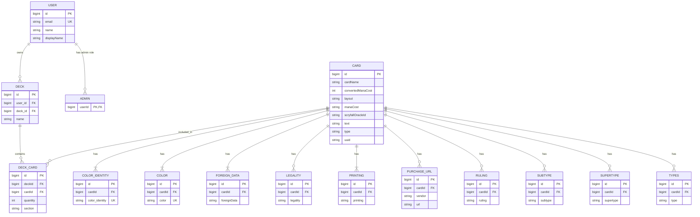

# <API name> Proposal

## 1. The pitch (one paragraph)
MagicShroom is an API that contains all magic cards in existance. It allows users to request the information of individual cards, users can gather cards together to form decks, and request the information of the decks associated with their account. A client app would need this for any magic card information, and if it planned on implementing decks and our API would provide a simple way of building decks and accessing their information;
 

## 2. Resources
| Resource | Key fields                                                                                                                                                                             | Relationships                                       |
| -------- | -------------------------------------------------------------------------------------------------------------------------------------------------------------------------------------- | --------------------------------------------------- |
| Admin    | id, name, displayName, email, userId                                                                                                                                                   | an admin to manage users                            |
| User     | id, name, displayName, email, deckId                                                                                                                                                   | a user has many decks                               |
| Deck     | id, cardId, userId                                                                                                                                                                     | A deck has many cards and is associated with a user |
| Card     | id, cardName, colorIdentity, colors, convertedManaCost, foreignData, legalities, manaCost, printings, purchaseUrls, rulings, scryfallOracleId, subtypes, supertypes, text, types, uuid | A card has many information fields                  |

## 3. ER sketch

erDiagram
    USER ||--o{ DECK : owns
    USER ||--o| ADMIN : "has admin role"

    DECK ||--o{ DECK_CARD : contains
    CARD ||--o{ DECK_CARD : included_in

    CARD ||--o{ COLOR_IDENTITY : has
    CARD ||--o{ COLOR : has
    CARD ||--o{ FOREIGN_DATA : has
    CARD ||--o{ LEGALITY : has
    CARD ||--o{ PRINTING : has
    CARD ||--o{ PURCHASE_URL : has
    CARD ||--o{ RULING : has
    CARD ||--o{ SUBTYPE : has
    CARD ||--o{ SUPERTYPE : has
    CARD ||--o{ CARD_TYPE : has

    USER {
        bigint id PK
        string email UK
        string name
        string displayName
        string role
    }

## 4. Endpoints
Some of 'em anyways...
| Verb   | Path                                  | Auth   | Purpose                             |
| ------ | ------------------------------------- | ------ | ----------------------------------- |
| GET    | /api/v1/cards                         | Public | List cards                          |
| GET    | /api/v1/cards?page=0&size=20          | Public | Paginated cards                     |
| GET    | /api/v1/cards/{cardId}                | Public | Get one card                        |
| GET    | /api/v1/cards?name=lightning          | Public | Filter cards by name                |
| GET    | /api/v1/cards?color=red               | Public | Filter cards by color               |
| POST   | /api/v1/cards                         | Admin  | Create a card                       |
| PATCH  | /api/v1/cards/{cardId}                | Admin  | Update a card                       |
| DELETE | /api/v1/cards/{cardId}                | Admin  | Delete a card                       |
| GET    | /api/v1/decks                         | User   | List the current user’s decks       |
| GET    | /api/v1/decks?name=deck1              | User   | Filter current user’s decks by name |
| POST   | /api/v1/decks                         | User   | Create a deck                       |
| GET    | /api/v1/decks/{deckId}                | User   | Get a deck                          |
| PATCH  | /api/v1/decks/{deckId}                | User   | Update a deck                       |
| DELETE | /api/v1/decks/{deckId}                | User   | Delete a deck                       |
| POST   | /api/v1/decks/{deckId}/cards          | User   | Add a card to a deck                |
| PATCH  | /api/v1/decks/{deckId}/cards/{cardId} | User   | Update quantity or section          |
| DELETE | /api/v1/decks/{deckId}/cards/{cardId} | User   | Remove a card from a deck           |
| DELETE | /api/v1/users/{userId}                | Admin  | Delete a user                       |

## 5. Technical choices
- **Database host:** Supabase, easy database access, good documentation, & render has only a month of free trial.
- **OAuth2 provider:** Google, and it does support code + PKCE
- **Repo layout:** Started with split but currently merging to monorepo because we believe that linking the API and the app will be more simple with a monorepo.
## 6. Risks We believe that the 2 things that are most likely to go wrong will be:
1. The current database design to dataset import. The database design doesn't look correct if taking into account how the dataset is set up. So likely we will need to take a good look at how the dataset is organized, which fields can be null, which fields require a separate linked table and which don't, before actually loading data into the database.
2. Testing, writing tests is going to be difficult. Not necessarily from a technical standpoint, more from an emotional standpoint &rarr; "I don't want to write tests, I just finished writing the code." A good way of getting ahead of this would be to make sure that each issue has at least one test defined that will test its functionality. Another would be to write the tests then to write the code. We'll start with the first and maybe pivot to the second if the first isn't enough.

## 7. Team and Sprint 1
Bryson- Database  
Kyle- OAuth & Misc. Help  
Tony- Frontend Basic App Design  
Brandon- Backend API Design  
[Project Board Link](https://github.com/users/NotaCatgirl/projects/1)  
[Sprint 1 Link](https://github.com/NotaCatgirl/MagicShroom/milestone/1)  